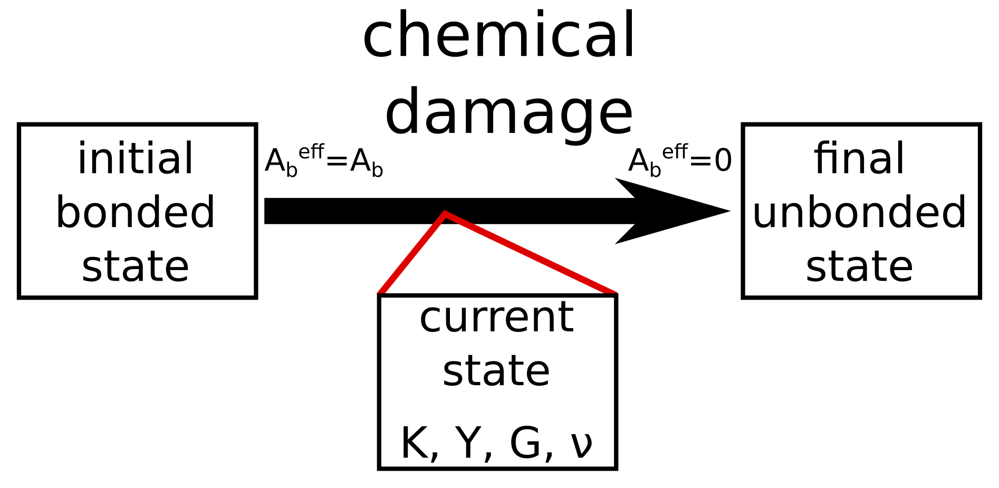
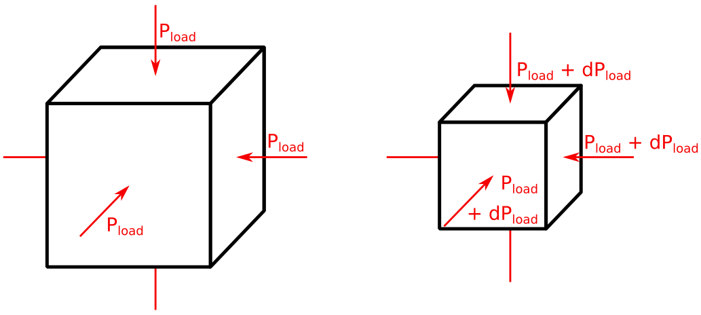
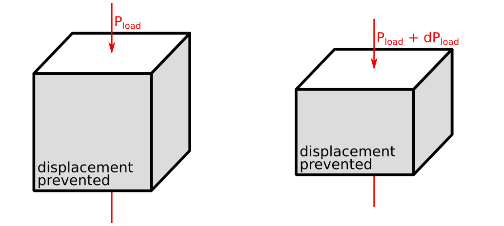
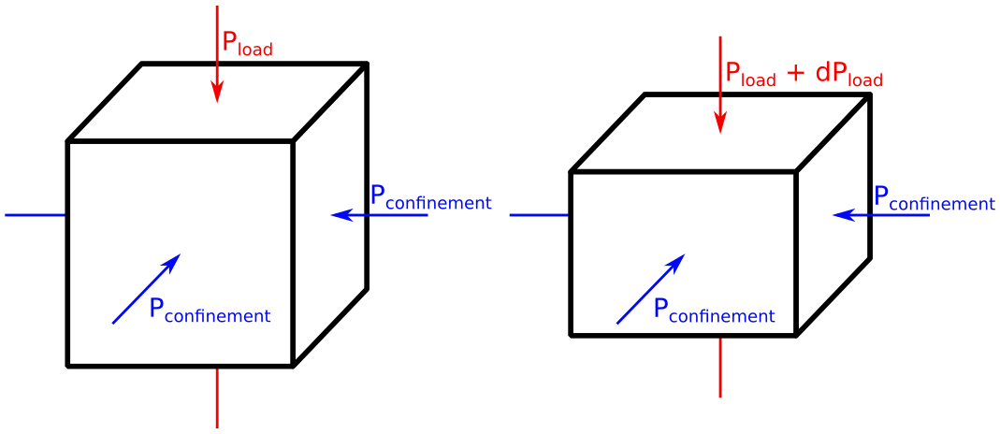

# Rock_Properties_MassRemoval
Determine elastic properties (Young modulus, bulk modulus, shear modulus, and Poisson ratio) of rocks with debonding. It uses [Yade](https://yade-dem.org/doc/) as a Discrete Element Model software.

This work is presented in the following paper: 
Fanyu Wu, Alexandre Sac-Morane, Hadrien Rattez, Manolis Veveakis, Manman Hu. (2025). Onset of reactive brittle cracking in sandstones: DEM-informed phase-field modeling. International Journal of Rock Mechanics and Mining Sciences. https://doi.org/10.1016/j.ijrmms.2025.106319

To do so, incremental perturbations are employed considering isotropic, oedometric, and triaxial loading conditions.

The same framework is employed, considering a Finite Element Model [here](https://github.com/AlexSacMorane/Rock_Properties_MassRemoval_FEM).

### Isotropic loading

The bulk modulus can be determined, considering: dP_load = K x depsilon_volumetric.

### Oedometric loading

The Young modulus can be determined, considering: dP_load = Y x depsilon_z.

### Triaxial loading

The Young modulus can be determined, considering: dP_load = Y x depsilon_z.  
The shear modulus can be determined, considering: dP_deviatoric = G x depsilon_deviatoric.  
The Poisson ratio can be determined, considering: 0.5 x (depsilon_x + depsilon_y) = v x depsilon_z.

## Technical description

The [discrete element model](https://en.wikipedia.org/wiki/Discrete_element_method) considers explicitly the grains and their interactions. 

The launch of this project and the definition of he parameters are done by executing the python script <i>Rock_Isotropic_MassRemoval.py</i>, <i>Rock_Oedometer_MassRemoval.py</i>, or <i>Rock_Triaxial_MassRemoval.py</i>.

A [documentation](https://alexsacmorane.github.io/dem/rock_props_debonding/) for the python script is available.

